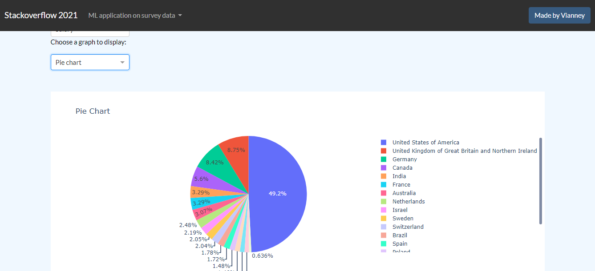
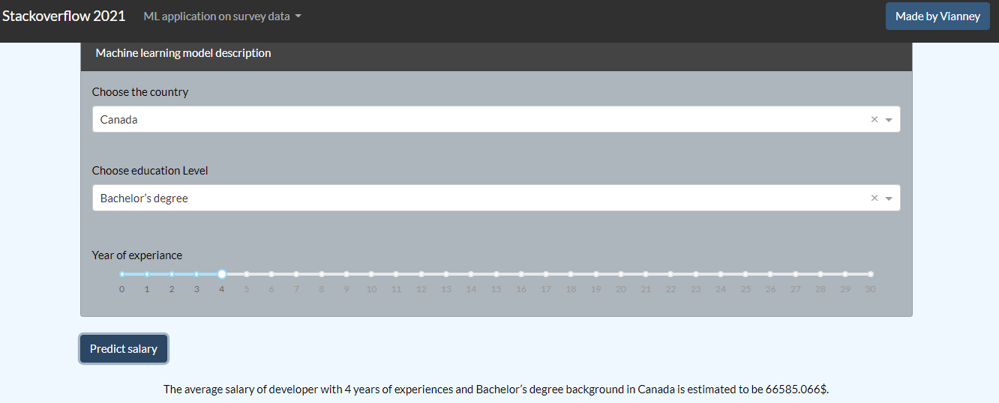

## stackoverflow machine learning application using Flask and Dash


Embed Plotly Dash into machine learning web application using Flask. Docker-based Flask project wrapping Plotly's Dash in one single Flask app.
## Overview


In this project, we use survey data from stackoverflow to predict developer salary by embed Plotly Dash into machine learning web application using Flask.
Full Data can be found [here](https://insights.stackoverflow.com/survey?_ga=2.167195582.1472615767.1671371818-997413825.1670328834) 

## What's included

Docker base image:
[https://github.com/tiangolo/uwsgi-nginx-flask-docker](https://github.com/tiangolo/uwsgi-nginx-flask-docker)

- [Bootstrap 5](https://getbootstrap.com/)
- [Dash Bootstrap Components](https://dash-bootstrap-components.opensource.faculty.ai/)

## Getting started
Make sure docker is running on your system.
```
git clone https://github.com/fermat01/stackoverflow-ml-app.git
cd stackoverflow-ml-app
docker-compose up -d
```

Go to url 
```
http://localhost:8080

```

An example of data visualization



An example of prediction on given input data



## TODO

- Machine learning algorithms can be improved for better prediction...
- Try different algorithms
